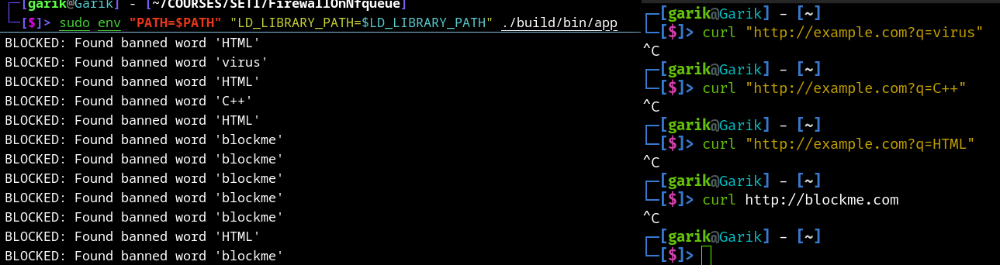

# Межсетевой экран на nfqueue

### Замечание
Это набросок структуры, проект ещё будет дописываться

## Быстрый старт
```shell
./runbuild.sh
sudo env "PATH=$PATH" "LD_LIBRARY_PATH=$LD_LIBRARY_PATH" ./build/bin/app
```

## Требования
+ `C++23`
+ `g++ (GCC) 14.2.0`
+ `cmake 3.16`
+ `clang-tidy/format-19`
+ `libnetfilter_queue`

## Пример работы

### Терминал 1
```shell
curl "http://example.com?q=virus"
curl "http://example.com?q=C++"
curl "http://example.com?q=HTML"
curl http://blockme.com
```

### Терминал 2
```shell
sudo iptables -A OUTPUT -p tcp --dport 80 -j NFQUEUE --queue-num 0
sudo iptables -A OUTPUT -p tcp --dport 443 -j NFQUEUE --queue-num 0
```

### Терминал 3
```shell
└─[$]> sudo env "PATH=$PATH" "LD_LIBRARY_PATH=$LD_LIBRARY_PATH" ./build/bin/app
Press Q to exit
BLOCKED: Found banned word 'blockme'
BLOCKED: Found banned word 'blockme'
BLOCKED: Found banned word 'blockme'
BLOCKED: Found banned word 'blockme'
BLOCKED: Found banned word 'blockme'
BLOCKED: Found banned word 'blockme'
BLOCKED: Found banned word 'blockme'
BLOCKED: Found banned word 'blockme'
BLOCKED: Found banned word 'blockme'
BLOCKED: Found banned word 'blockme'
BLOCKED: Found banned word 'blockme'
BLOCKED: Found banned word 'C++'
BLOCKED: Found banned word 'C++'
BLOCKED: Found banned word 'C++'
BLOCKED: Found banned word 'C++'
BLOCKED: Found banned word 'C++'
BLOCKED: Found banned word 'C++'
BLOCKED: Found banned word 'C++'
BLOCKED: Found banned word 'C++'
BLOCKED: Found banned word 'C++'
BLOCKED: Found banned word 'virus'
BLOCKED: Found banned word 'virus'
BLOCKED: Found banned word 'virus'
BLOCKED: Found banned word 'virus'
BLOCKED: Found banned word 'virus'
BLOCKED: Found banned word 'C++'
BLOCKED: Found banned word 'virus'
BLOCKED: Found banned word 'virus'
BLOCKED: Found banned word 'C++'
BLOCKED: Found banned word 'C++'
BLOCKED: Found banned word 'C++'
BLOCKED: Found banned word 'C++'
BLOCKED: Found banned word 'C++'
BLOCKED: Found banned word 'C++'
BLOCKED: Found banned word 'C++'
BLOCKED: Found banned word 'virus'
BLOCKED: Found banned word 'C++'
BLOCKED: Found banned word 'C++'
BLOCKED: Found banned word 'C++'
BLOCKED: Found banned word 'HTML'
BLOCKED: Found banned word 'HTML'
BLOCKED: Found banned word 'HTML'
BLOCKED: Found banned word 'HTML'
BLOCKED: Found banned word 'HTML'
BLOCKED: Found banned word 'virus'
BLOCKED: Found banned word 'HTML'
BLOCKED: Found banned word 'C++'
BLOCKED: Found banned word 'HTML'
BLOCKED: Found banned word 'blockme'
BLOCKED: Found banned word 'blockme'
BLOCKED: Found banned word 'blockme'
BLOCKED: Found banned word 'blockme'
BLOCKED: Found banned word 'blockme'
BLOCKED: Found banned word 'HTML'
BLOCKED: Found banned word 'blockme'
BLOCKED: Found banned word 'blockme'
BLOCKED: Found banned word 'HTML'
```


